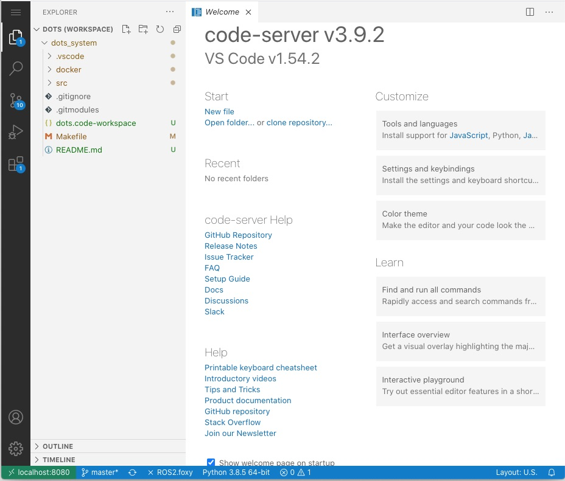
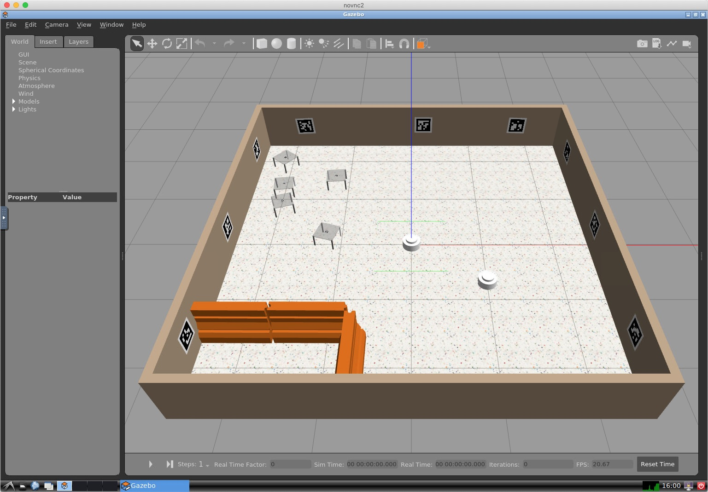
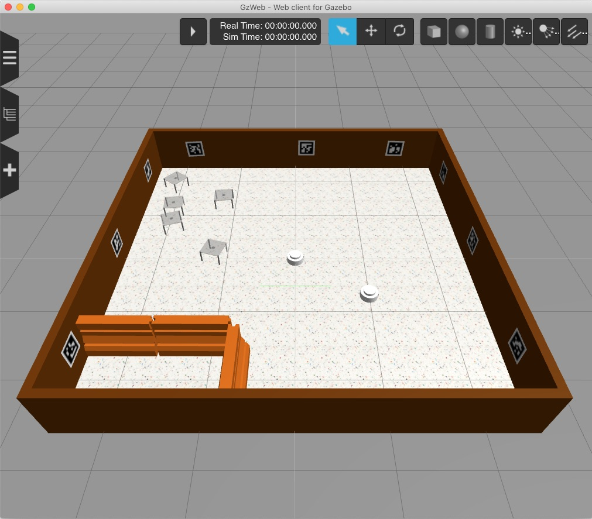

# Dots development environment

This is the Dots development environment. It is based on Docker containers, so it can run on Windows, Linux, and OSX. The directory where the environment is started is mounted within the environment so all changes are persistant.


## Prerequisites
- Working Docker installation
- (On windows) Windows System for Linux (WSL2) and Ubuntu 20.04  
    - Install WSL2 (https://docs.microsoft.com/en-us/windows/wsl/install-win10) and Ubuntu 20.04 and make sure WSL2 is enabled, not WSL1
    - Install Docker Desktop https://hub.docker.com/editions/community/docker-ce-desktop-windows/
    - Run Docker Desktop and make sure  the Ubuntu 20.04 is enabled in Settings->Resources->WSL integration
    

- git and make

## Installation
Firstly, you need to set up SSH keys on your bitbucket account if you haven't already, without this the git checkout will not work.

At your command prompt (Ubuntu 20.04 WSL2 on Windows) do the following, pressing return to all prompts. 
```
$ ssh-keygen
$ cat ~/.ssh/id_rsa.pub
ssh-rsa AAAAB3NzaC1yc2EAAAADAQABAAABgQC90jZf+uTA5MwHzEESZ+aAEqUB8yGOgQX/NM7fgn+difjKspAGn2Zt/rf4QRachx3yfBAkwZpaBtqiav/sthZiXyO0YZk1w8DkQNwEr4J4QxRnmOPHuqAQ2y5b4IzP1ob9KL9XXDGQxEh804NI7MRHLgUgDQkYz2Z+2wG6ZCB6Ao7tHXRdcY39vtUAQhfi7WCaYlDtZVw5r/6XBFH+tqmnwgYh4T9ULi3cTzLvBj7G9/UTBt4LC0bZenbSR6jy2gX6Fg+KzeDHeh0bu1ZhWf1mxiHw7OACcagQ92xhd+kBdzHrLsVgdCHDdVwMFmemlcs17D/1uc70KnrJY3qoiNhqGI799n7vUGxVydFoGjuw76Om/3cIKYMVvy+QhzT0zftTb3lk0XnmC6TYz+Haaj4Aomy2+E4J6xsE2vZsd9xqaXr3TDsjRMt/qppeHwxUc8O86sgGQqOKLtOlSCPnQkTbSziruF4NP4RJokAEJhZnIexB0HwlXRfY5z/fePmcK2U= simonj@Simons-iMac-Pro.local
```
This gives a long multiline output, example from mine shown. Copy the whole thing, starting from ```ssh-rsa```, then sign in to your bitbucket account and go to personal settings (icon at bottom left), then SSH keys, then do Add key. Give the key a name then paste the key into the box.

To download and start the environment, go to the the directory you want to keep your work, and do:
```
git clone --recursive git@bitbucket.org:hauertlab/dots_system.git
```

To build the system, do:
```
cd dots_system
make
```
This will build the docker images. The build process may take some time the first time it is done. On a fast machine with SSD and lots of memory it took about 5 minutes. On  a mediocre laptop running Windows it took about 30 minutes.

The system is started using docker-compose. Do:
```
make run
```
to start the docker environment up.

The environment presents two interfaces, both web-based. The [VSCode interface](http://localhost:8080/?workspace=/home/dots/dots_system/dots.code-workspace) is a web version of the VSCode editor. This is where you will do most coding. Click the link and you should see something like:


The [Linux desktop](http://localhost:8081/) is a web-based VNC view into a standard Linux desktop. Graphical applications such as Gazebo and Rviz will appear here. The size of the desktop is based on the size of the browser window when you open the link - make a separate browser window the size you want before opening the link.

To make sure everything is working, open a terminal in the vscode window by going Menu (top left)->Terminal->New terminal. This places you in a ROS2 workspace with the various packages for the simulator and example controller below the ```src``` directory. The simplified package structure is:
```
src
├── dots_controllers
│   └── dots_example_controller
├── dots_gazebo
│   ├── dots_sim
│   ├── dots_sim_support
│   └── gazebo_plugins
└── dots_support
    ├── bagparse
    ├── dots_tf_tools
    ├── dots_vision
    └── urdf_prefix
```
To build the packages, do:
```
colcon build --symlink-install
source install/setup.bash
```
This will traverse the packages in the ```src``` directory, compile C++ code, then install C++ and Python executables and support files. These are placed in the ```install``` directory. The ```source``` command makes the just installed packages visible to the ROS system. To run an example, do:
```
ros2 launch dots_example_controller run_2_explore.launch.py use_gzclient:=true
```
This will start the Gazebo simulator GUI in the Linux desktop, then spawn two robots at different locations within the simulated world. It should look like this:



The simulator starts up paused, press play to start it running. The two robots should move in random curved trajectories, changing direction when they encounter an obstacle.

## GZWeb (experimental)
There is experimental support for [GZWeb](http://gazebosim.org/gzweb.html). This is a WebGL based browser front-end to Gazebo with a UI that is much more performant than the VNC-based GUI interface, but it is less mature. To try it out, add ```use_gzweb:=true``` to any launch command that would normally start the standard front-end. Connect [using this link](http://localhost:8085/).

For example, run the explore example like:
```
ros2 launch dots_example_controller run_2_explore.launch.py use_gzweb:=true
```
It should look like this:



## Developing
The general development flow is to make changes to your code, do ```colcon build --symlink-install```, then try out your changes. Its only necessary to do ```source install/setup.bash``` in a new terminal or after building for the first time. If you make changes to Python code, it is not usually necessary to do ```colcon build``` since symbolic links are installed for interpreted code, but sometimes this doesn't seem to work. You can build just the package you are working on, e.g:
```
colcon build --symlink-install --packages-select dots_example_controller
```
which helps if you are working on a slow machine.

It is possible to start various parts separately, you might often want to e.g. have the simulator running while manually starting robots.
Some possible examples, launch with the Rviz2 app to visualise robot sense data:
```
ros2 launch dots_example_controller run_2_explore.launch.py use_rviz:=true use_gzweb:=true
```
Just launch gazebo:
```
ros2 launch dots_sim gazebo.launch.py
```
Launch a single robot without a controller at a location within the arena (requires Gazebo to be running, will wait for it to be started)
```
ros2 launch dots_example_controller basic.launch.py robot_name:=r1 robot_pose:=-0.2,0.3,1.57
```
In another terminal, send a velocity command to the robot launched in the previous step:
```
ros2 topic pub /r1/cmd_vel geometry_msgs/msg/Twist "{linear: {x: 1.0, y: 0.0, z: 0.0}, angular: {x: 0.0, y: 0.0, z: 2.0}}"
```

## Working with submodules
The project structure uses a git submodule for the simulator. This is a separate git repository within the directory structure of a master git repo. 

Clone whole environment:
```
git clone --recursive git@bitbucket.org:hauertlab/dots_system.git
```
Get all updates:
```
git pull
git submodule update
```
You will be working within the main repo, creating and modifying ROS packages under the ```src/dots_controllers``` directory. Working in this way, the standard git commands work as normal:
```

# Get updates from remote
git pull            
<make edits and changes>
# Commit the changes
git commit -am 'commit message'
# Push changes to remote
git push
```


## Interface links
|Link|Interface|
|-|-|
|http://localhost:8080/?workspace=/home/dots/dots_system/dots.code-workspace|VScode editor and terminal, in the Dots system workspace|
|http://localhost:8081/|Web VNC to Linux desktop, for conventional Gazebo front-end and other graphical linux applications|
|http://localhost:8085/|GZWeb browser front-end for Gazebo|


## Example controller
The example controller source code is in ```src/dots_controllers/dots_example_controller/dots_example_controller/explore.py```.

This is a very basic controller that just uses the time-of-flight sensor to detect obstacles and change direction.


## Behaviour Tree Carrier controller
This controller is more sophisticated and demonstrates how to use the vision system to recognise the tags on carriers and navigate using them. You can try this out with:
```
ros2 launch dots_example_controller run_1_carry.launch.py use_rviz:=true use_gzweb:=true
```

The carriers in the arena are all annotated with tags. On each of the four sides is a marker with the ID of the carrier, in the range 100-119. This is used to locate carriers and position the robot relative to them. On the underside of each carrier is an ArUco markermap, a 7x7 array of markers in the range 200-248 that are regarded as a single occlusion-resistant marker for the purpose of pose generation.

This launches five vision nodes from the ```dots_vision``` package, code in ```dots_support/dots_vision/src/vision.cpp```, that process the image stream from each of the cameras, outputting transforms of the ID tags and the marker map to the TF tree and also messages about the currently detected tags to the topic ```/<robot_name>/cam[0-4]_tags```. 

Another node, in ```src/dots_controllers/dots_example_controller/carry.py``` implements a behaviour tree controller. In order of priority, it does the following:
- If there are no ID tags visible, it chooses a new random direction every five seconds and moves with collision avoidance.
- If there is a tag visible in one or more cameras, one tag is chosen and the robot positions itself so the camera seeing the tag is 200mm away from the tag and lined up with it.
- If the robot is lined up with a tag and stable, it moves forward to be under the carrier
- If the robot is under the carrier (detected by a markermap being visible to the upward-facing camera) it uses this to centre itself under the carrier.
- If the robot is centered, it raises the lifting platform to pick up the carrier then moves in the +x direction.

This is crude in that there is little in the way of recovery, but it does demonstrate how to use the vision tags and the py-trees behaviour tree package. This is the first time I've used py-trees, so the style may not be the best! As usual, there are interesting design decisions about what goes in the behaviour tree and what is coded internally. I've chosen to perform all the transform and tag recognition logic internal to the behaviour ```Process_vision```, presenting detection flags and alternative already calulated velocity values in the blackboard. The tree logic uses these to decide what values to send to ```cmd_vel``` to actually control the robot.


## Issues
Sometimes the linux desktop does not correctly size to the window size. Sometimes reloading the page in the browser fixes this. If not, the only other fix so far is to ctrl-c the docker session and restart with `make run`.

Sometimes the Gazebo simulator doesn't corectly stop when  ctrl-c'd. A new simulation won't start because another copy is already running, there will be an error message like `EXCEPTION: Unable to start server[bind: Address already in use]. There is probably another Gazebo process running`. We have defined a script to kill all ROS processes that have been started in a terminal, do `killros` before starting new simulation.


# Technical details
The development environment is designed to model the Dots robots physical hardware in some detail but not with extreme accuracy or where that would compromise simulation speed excessively.

## Robot hardware
The robots are circular, 250mm in diameter, with a lifting platform on top. They have the following specifications:

|Spec|Value|Notes|
|-|-|-|
|Mass|3kg||
|Battery life|6 hours||
|Drive|Holonomic||
|Linear velocity|1.0m/s||
|Angular velocity|6rad/s||
|16x laser range finders|2m range|50Hz update|
|Perimeter cameras|640x480 120 degree|Overlapping vision all round|
|Lifter camera|640x480 120 degree|Upwards facing in centre of lifter|
|IMU|6 DoF||
|Compass|||
|16x perimeter RGB leds||
|Processor|Rockpi4B|RK3399, 6 core, 4Gbyte ram|


## Multiple robots
Using multiple robots under ROS has not been the primary focus, so, particularly with ROS2 it is necessary to define how they will interact. We use the following approach:
- All nodes are namespaced with the robot name
- The robot model URDF is processed to prefix link names and topic names associated with plugins with the robot name
- The transform tree topics are remapped from absolute to relative ```/tf``` to ```tf```, and ```/tf_static``` to ```tf_static```. This means each robot has its own transform tree
- Each robot has a ```tf2_relay``` node, that echos a subset of topics to the global ```tf``` tree.

### Connectivity
ROS2 is decentralised and allows all robots to see any topics on the network. We don't prevent this, but any developer must be aware that using topics from another robot is inherently unreliable, as they will depend on WiFi and be prone to interference. Swarm solutions would tend to use local information.

## Topics
In the real robot there is a node talking to the hardware that provides many of these topics. In simulation, some are provided by Gazebo plugins, and some by a node called fake_dots_node.

|Topic|Type|Notes|
|-|-|-|
|battery_state|sensor_msgs.BatteryState|Simulation always shows 80%|
|cam0/camera_info
|cam0/image|sensor_msgs.Image|Front left camera|
|cam1/camera_info
|cam1/image|sensor_msgs.Image|Back left camera|
|cam2/camera_info
|cam2/image|sensor_msgs.Image|Back right camera|
|cam3/camera_info
|cam3/image|sensor_msgs.Image|Front right camera|
|cam4/camera_info
|cam4/image|sensor_msgs.Image|Upwards facing lifter camera|
|cmd_vel|geometry_msgs.Twist|Sets the robot velocity, response is not instant but this is the least accurate part of the model|
|led|std_msgs.Int32MultiArray|Exactly 16 entries, one for each LED, blue=bits[23:16], green=bits[15:8], red=bits[7:0]|
|lifter|std_msgs.Bool|Send False to lower, True to raise. This will be controlled by an action server in future|
|odom|nav_msgs.Odometry|Feedback of position and velocity estimates from wheel encoders|
|sensor/imu|sensor_msgs/Imu|Feedback of angular velocity and linear acceleration from IMU sensor|
|sensor/scan|sensor_msgs/PointCloud2|Range data from the 16 time of flight sensors|
|sensor/compass|std_msgs/Float32|Heading of the robot. In simulation this is derived from the simulator ground truth with some Gaussian noise sigma=0.1 added. Heading 0 is east (+x)|

There are other topics but these cannot be relied on in the real robots. For example, each robots pose is published on the ```ground_truth``` topic.


## Transferring controllers to the real robots
The Docker environment replicates the software environment of the robots fairly closely. All the packages that are available on the real robots are installed. What cannot be replicated is the difference in performance.

The robots use a RockPi 4B 4GByte Single Board Computer. This is based on the Rockchip RK3399 SoC, a 6x ARM core big.LITTLE with 2x Cortex-A72 (fast) and 4x Cortex-A53 (small). The performance is faster (~50-100%)than a Raspberry Pi 4 but nothing like the speed of a decent PC.

Controller solutions that use intensive processing are unlikely to transfer well to the real robots. As a measure of how much processing can be done, running five instances of the ArUco tag recognition library, one for each camera, on the real robots shows about 50%-60% of a CPU is needed for each instance.

## Differences between simulation and real robots
There are a number of areas


# Useful stuff

## Create TF tree pdf
```
ros2 run tf2_tools view_frames.py
```
Creates a PDF in the current directory of the TF tree.
## Killing left over processes
Its common after ctrl-c for some processes to not get shut down properly, particularly the Gazebo server. Included in the environment is the scripts ```killros```, this kills all processes that have been started in that terminal shell. 


